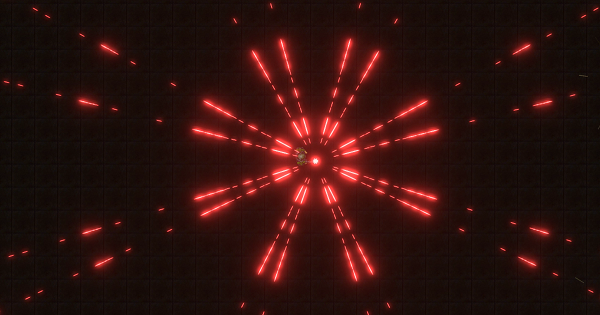
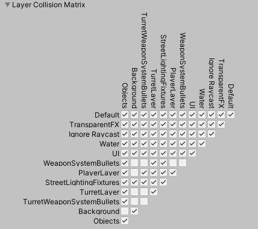
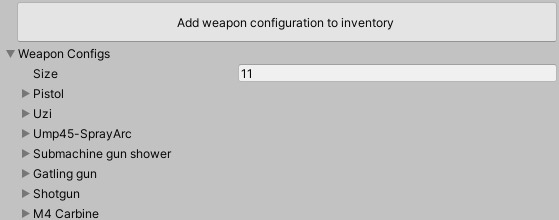
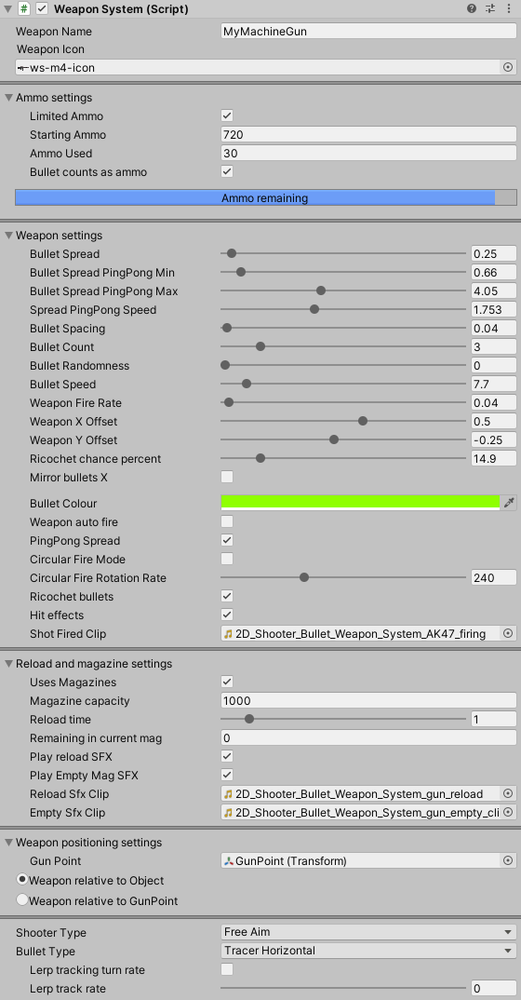

# 2D Shooter Bullet and Weapon System for Unity

Unity 2019, 2018, and 2017 supported!

## Asset contents

1. Bullet pattern, weapon system, and inventory / preset / selection component script, including custom editor/inspector and inventory manager with re-order/clone/delete weapon configuration support
2. Bullet / Object Pooling manager script
3. Bullet script + 2 x base bullet prefab types to use with the bullet / object pooling manager
4. Player movement / control script with 2 x modes (top down shooter and side scroller shmup)
5. Lots of sample / demo background, bullet, player, and object sprites (space ship sprite, crate, space platform and turrets, and a zombie character sprite with walk animation)
6. 4 x demo scenes with fully customisable controls / examples
7. Lots of weapon audio SFX samples to use for bullet firing, reloading etc...
7. This readme file

WebGL demo: [https://gameassets.hobbyistcoder.com/products/2dsbaws/webgl/](https://gameassets.hobbyistcoder.com/products/2dsbaws/webgl/)

## Introduction

Website: [https://gameassets.hobbyistcoder.com](https://gameassets.hobbyistcoder.com)

This asset provides you with a highly customisable bullet and weapon system, along with a bullet pooling manager which is simple to drop into your Unity game or project and start using right away. The system allows for many different bullet pattern configurations and customisations, as well as ricochet (bounce) and bullet impact effects like sparks and blood. In addition, you also get: 

- A customisable player movement script which allows for two modes of player movement controls (top down shooter and shoot-em-up/shmup).
- A weapon configuration editor and inventory system, allowing you to create weapon configurations (different bullet patterns, properties, ammo / magazine clip configurations etc...)
- 4 x demo scenes showing some different uses for the asset

The system allows you to easily create preset weapon configurations with custom bullet patterns or weapon types for your 2D games.

Whether you are creating bullet hell shmups, or top-down zombie defense games, the bullet and weapon system is fully customisable.

The WeaponSystem script has a custom inspector/editor and contains sliders for every property on the weapon allowing you to easily control properties like bullet count, fire rate, bullet randomness, spread, offsets, and even alternate properties like spread size on an alternating timer system.

This amounts to a huge number of possible bullet patterns and weapon types. In addition to these properties, you can also add other customisations such as reload capability, magazine / clip usage, reload times, sound effects, and weapon inventory. The system also has some handy events that you can hook up the rest of your game to.

View the full API documentation here for details around the different fields, methods and events available here: [https://gameassets.hobbyistcoder.com/products/2dsbaws/docs/annotated.html](https://gameassets.hobbyistcoder.com/products/2dsbaws/docs/annotated.html)

## Demo scenes

1. "Weapon Configuration and Inventory scene". Show case for the system that allows you to create your own weapon configurations and assign them to inventory slots for players or AI to use in-game. Includes some Physics2D objects and Target dummies to shoot at and view bullet ricochets, hit spark effects, and blood effects. Also demonstrates hooking up a GUI to the WeaponSystem component and events to show how you could integrate with your own GUI solution. You can also use the sliders in-game to change bullet and weapon configurations on the fly.

2. "Space platform defense" This demo shows off the weapon configuration and inventory system, as well the reload / ammo and some basic bullet pattern support that the asset has to offer. It also provides a simple GUI interface (using Unity's uGUI system) to demonstrate some ideas of how you can hook your own GUI system up to show things like ammo usage, magazine / clip sizes, weapon icons, etc... A few alien ships fly around with shields that are able to deflect bullets (using the system's built in ricochet support). Scroll your mouse wheel to switch weapons (which selects different defense turrets with different weapon configurations). Left click to fire, and "R" to reload (for weapon configurations set up to use magazines). The enemies have no HP, so you can keep firing at them.

4. "Space shmup" A simple shooter / shmup scene demonstrating different player controls and the ability to customise some bullet pattern properties.

5. "Enemy Turret" A basic demo scene showing how you can set up different Weapon Systems on NPCs or enemies to have different bullet patterns or weapon configurations that are also able to track the player.

## Usage

### Setup requirements

- Ensure you create two new layers in your project under **Edit -> Project Settings -> Tags and Layers**. Name one layer **WeaponSystemBullets** and the other layer **PlayerLayer**.
- Bullets are set by default to be created on **WeaponSystemBullets**. You should also set your player/character to the **PlayerLayer**.
- Go to **Edit -> Project Settings -> Physics 2D**, and disable gravity (set to **0**). You'll also need to disable collisions between the **WeaponSystemBullets** (itself) and the **WeaponSystemBullets** and **PlayerLayer**. This is so that bullets do not collide with each other, and do not collide with the player either.

- An alternative to the above step is to keep your gravity settings, but set the Bullet Prefabs **RigidBody2D** components to have a **Gravity Scale** of **0**.
- Ensure any objects you wish bullets to bounce off of, or have hit effects on, have a 2D collider that is not set to a trigger.
- If you wish for an object to emit a blood spray effect, ensure you setup the included Object Pool Manager to use the blood prefab and specify how many of these to initially spawn into the pool. Then set your enemy/object tags up to use a tag name that matches the tag you set on your bullet prefab (**bloodEffectTriggerTag**). The default tag trigger name is set to **Enemy** on the dummy target prefab included.
- The above steps are important to ensure bullet collisions and hit effects work correctly, as well as to ensure that the collision detection code does not fail.

## General usage and more about all the features

To use the bullet/weapon system asset, all you need to do is import the asset into your project and follow the next steps:

- Drop the **WeaponSystem.cs** script onto your player GameObject.
- Ensure you also have a GameObject added to your scene that holds the **ObjectPoolManager.cs** script.
- Drag and drop a bullet prefab from the prefabs folder to your **ObjectPoolManager** bullet prefab properties, set the number of bullets to initially pool at the start of the scene (if you are firing lots of bullets from weapons, you should pool a few hundred bullets at least).
- The player GameObject that holds your **WeaponSystem** component should also have a 'child' GameObject with just a standard **Transform** component added.
- Drag and drop this child GameObject to the slot (field) on your **WeaponSystem** component called **GunPoint** - this is a reference point that is used for the bullets to be fired from, so you can position this child GameObject where your player's weapon sits normally.

Note that there are actually two modes to use for positioning on the WeaponSystem component ("**weapon relative to object**", and "**weapon relative to GunPoint**"). 

- The first (relative to object) is the default, and means that you can use the **Offset X** and **Offset Y** parameters too). In this mode, bullets are fired from the GunPoint transform you assign, and when you move your mouse around, the transform that holds the main WeaponSystem script rotates to face this direction.
- In the second mode (relative to GunPoint), the offsetX and offsetY properties are ignored, and when you move your mouse around to aim, your GunPoint transform is rotated to face the direction instead of the transform holding your WeaponSystem component. This mode is useful if you want to position multiple "turrets" on a player for example, and you can see it in action in the "Space platform defense" demo scene that is included. When you switch weapon configurations the GunPoint transform on each Weapon Configuration is re-assigned to the WeaponSystem component and it rotates to face your mouse cursor / aim, and is used as the location for bullets to be shot from.

### Adding Neon Bloom / Glow

**Note:** For Bloom effects to work, you must install the Unity **Universal RP** and **Post Processing** packages using the Unity **Package Manager** window.

Go to your **Main Camera** GameObject and enable **Post Processing**.

Create a new **GameObject** in your Scene **Hierarchy** and name it **GlobalBloomVolume**. Use the Inspector to add a **Volume** component. In the **Volume** component Inspector options, click **New** next to the **Profile** field. A new profile called **Volume Profile (VolumeProfile)** is created.

Click the **Add Override** button and type **Bloom** to add a Bloom volume effect.

Configure the **Bloom** settings to have:

* **Threshold: 0.7**
* **Intensity: 20**

## Next Steps

That's it for the getting started bits. This weapon system script includes 13 preset weapon types so you can get started right away with included weapons such as the gatling gun, shotgun, dual arcing machine gun, etc...

These are basic "preset" patterns that you can use, but the real power comes in when you use the Weapon System Configuration custom editor / inspector to create weapon configurations to add to your player / character / enemy inventories.

The configurations are serialized and stored so that when you start your game, and they can be switched between (default is mouse wheel up and down).

When weapon configurations are switched you can access each weapon configuration's properties like weapon icon (for the GUI), ammo, magazine size, etc... The weapon system component also automatically picks up the new configuration and fires that type when you shoot (mouse button 0 by default).

To create your own weapon types, play with the sliders on the WeaponSystem.cs script when your game is running to see how the pattern looks. Ideally though you'll use the custom inspector editor to setup your weapon configurations, and click the button to add the configuration to inventory.

Using the inventory list at the bottom of the WeaponSystem component, you can then re-order weapon inventory, duplicate/clone weapons, as well as remove them.

This makes it easy for you to change your player's weapons during the game. Remember there are two ways of changing weapons in-game:

1. Use Weapon Configurations and the default mouse wheel up / down (new as of version 1.3)
2. (Note this option is legacy and pre version 1.3) - Change the BulletPreset property on your player WeaponSystem component from anywhere in your game. As soon as you do this, the BulletPresetChanged event will fire, and when this happens the BulletPresetchangedHanlder method is run right away, setting the settings on your weapon to map to presets defined in your WeaponSystem component code, so that when it fires, the new type of bullet pattern is emitted.

An example of using the new weapon configuration method: Create some weapon configurations using the Weapon System component editor / inspector, and add these to the inventory. Choose bullet pattern settings using the options and sliders, and choose the type of bullets, aim mode, whether to use magazines / clips and ammo or not, and then start the game and switch weapons using mouse wheel up and down.

An example of referencing your WeaponScript bullet preset property from anywhere in C# code using the legacy (old) switching mode would be:

    var weaponSystemRef = MyPlayerGameObject.GetComponent<WeaponSystem>();
	weaponSystemRef.BulletPreset = WeaponSystem.BulletPresetType.Tarantula;
	// Selects the "Tarantula" weapon type and the next time the player shoots, he/she will use this weapon and bullet pattern.

Refer to the `DemoSceneManager.cs` script for more examples of controlling the asset in code.

## More help

Check the tooltips by hovering over the various options in the custom WeaponSystem script inspector - all properties are decorated with detailed information in the tooltips to help explain what they do if you are unsure!

### Controls

By default some controls are hardcoded into the WeaponSystem.cs script. If you wish to use your own input system, please take a look in the main `Update()` method for the Handling methods that are called for controls. By default the following is setup:

1. WASD - movement - uses the "PlayerMovement" script for this, not the WeaponSystem script.
2. Left click - shoot
3. R - Reload if using magazines
4. Mousewheel scroll up/down - change weapon configurations if configured

### Setting game type - horizontal, vertical shmup or free aim top down shooter

There are more properties to change the system to run in different player control / styles (horizontal shmup, vertical shmup, free aim top down shooter), or to change bullet types and colours. There is also a PlayerMovement.cs script included. When you wish to change the game style - e.g. horizontal shmup or free aim top down shooter, you could change the shooterDirectionType enum property on the WeaponScript component as well as the playerMovementType enum property on the PlayerMovement component accordingly. You can mix modes too. For example, you could have horizontal shmup controls on your player, but with a free aim WeaponSystem component. WASD and the arrow keys would move your player up down / left and right, and you would use the mouse to aim your weapons. Or you could have a FreeAim movement selection on your PlayerMovement, with free aim shooting on your WeaponSystem component. Here is an example of setting the player to use a FreeAim weapon and player movement configuration:

    var weaponSystemRef = MyPlayerGameObject.GetComponent<WeaponSystem>();
    var playerMovementRef = MyPlayerGameObject.GetComponent<PlayerMovement>();
    
    weaponSystemRef.shooterDirectionType = WeaponSystem.ShooterType.FreeAim;
    playerMovementRef.playerMovementType = PlayerMovement.PlayerMovementType.FreeAim

### Bullet hit effects and ricochet support (sparks and blood)

You are also able to enable bullet hit effects (a spark particle system, or blood particle system hooked up to the built in object pool manager). To use bullet impact effects, simply check the box on the WeaponSystem script to enable bullet hit effects.

Remember to ensure your Object Pool Manager which is included with this asset has a "spark particle prefab" and "blood particle prefab" assigned and set to pool first. You can find these two prefabs in the Prefabs folder of the asset package.

For the blood particle hit effect, you should select your bullet prefabs and assign a "trigger tag" for the blood particle effect to be used. Select your bullet prefab that has the "Bullet.cs" component attached, and enter a tag name. When the bullet impacts a collider, if the collider gameobject has the same tag you specified, a blood spray particle effect will be created from the object pool. Currently this only occurs if the "BulletOwner" is set to the Player (i.e. enemies hit will spurt blood spray). You can change this check quite easily in the Bullet.cs script if you wish. By default the blood trigger tag is set to "Enemy".

To allow bullets to ricochet, you need to check the box on the WeaponSystem script to enable ricochets. There is a slider that will allow you to determine the percent chance that a bullet has to ricochet on impact with a 2D collider. Each subsequent bounce/ricochet will then have this same percent chance to ricochet again. If a bullet hits a collider without a ricochet occuring, then the bullet will be destroyed (returned back to the bullet object pool by being disabled).

If you wish for bullets to collide with objects, ensure your object has a 2D collider attached, and that it is NOT set to be a "trigger".

If you look at the Demo Scene included with this asset you will also see an example of collision layers being used to ensure bullets are kept on a separate bullet layer. This layer is then marked in the collision layer matrix to not allow collisions with itself - therefore bullets do not affect each other in terms of collisions.

If you wish to exclude other layers from being affected by bullet collisions, ensure you mark them as such in the layer collision matrix (Physics2D settings in Unity).

It is also a good idea to have your main character/player on a layer that is excluded from collisions with the bullet layer - this way if your player uses a collider too, then it will not be hit by it's own bullets.

You can look at the demo scenes for more examples of setting different weapon types, bullet patterns, weapon configurations, ammo and magazine usage as well as movement types.

### Bullet and object pool usage:

The included `ObjectPoolManager.cs` script is a single instance manager script which has two entries defined already for the two bullet types included with this asset, as well as the spark hit effect and blood effect.

You can use this manager to pool other items in your game too if you wish - enemies, items, etc...

All you need to do is make an entry for the gameobject prefab, set an integer to define how many of each you would like pooled at the start of the game, and create a method used for pulling out an item from the relevant pool. For examples on how to do this, simply refer to the existing three methods in the object pooling manager script.

Make sure you only ever have one instance of this script in your scenes!

## Getting in Touch

If you have any further questions or need help, please feel free to get in touch. Contact details can be found on the Unity Asset Store page for this asset, or grab me on twitter @shogan85.