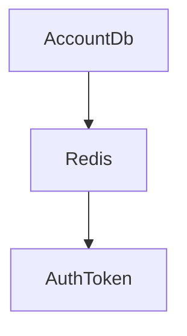

##   
# [UnityKoreaAward] : 팀명 수정 예정
### ASP.NET Core 7버전으로 작성한 Web API 입니다.

개발 시작일 23.07.10(월)
## 7월 10일 개발일지
### 개발 사항 : 
1. 게임 기획 초안이 완성 되지 않은 상황이여서, 우선 CreateAccountAPI 및 LoginAPI 기본 구현
2. Ngork 터널링 툴을 이용한 로컬 서버 외부 접근 허용
3. 유니티로 LoginAPI 간단하게 테스트 코드 작성
4. 최신 게임을 다운 받아 해본결과 구글 및 feackbook 계정 연동 구현의 필요성을 인지 하여 구글 부터 구현 시작 (미완성)
   
### 오늘 개발 이슈 : 
1. Properties폴더의 sslPort 설정 및 appsettings.json prot 설정 불일치로 서버 연결 오류
2. 라우팅 및 미들웨어 추가 부주의로 인한 라우팅 오류
3. google login API 호출 하면 로그인 페이지 생성 안됨

### 받은 피드백 : 
1. 지금은 내가 지정한 ErrorCode 만 응답을 보내는데, 받는 클라이언트입장의 더 생각 해야한다.
   ResultCode 와 메시지를 같이 보내야 한다.
2. 응답의 성공과 실패 여부 추가.

### 7월 11일 (예정)
1. 구글 로그인 연동
2. 페이스북 로그인 연동
3. Response 딕테일화
4. 테스터 용이성을 위해 LocalTunnel 이용해 서브 도메인으로 APIURL 생성하기

