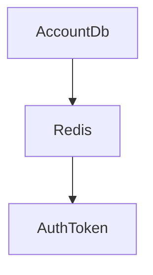

##   

### ASP.NET Core 7버전으로 작성한 Web API 입니다.
### 개발 시작일 23.07.10(월)

## 7월 12일(수) 개발일지
### 개발 사항 : 
1. MySQL Connection Handler 클래스 추가
   (목적 : DB 연결 비용 비용을 줄이기, 중복 코드 줄이기, 재사용성 높이기)
   
### 오늘 개발 이슈 : 
1. 구글 로그인 연동 테스트 오류 발생
2. 개인 사정으로 인한 개발 시간 부족으로 인해 오늘 개발 목표 미달성

### 7월 13일(화) (예정)
1. 로그인 후 유저 게임 데이터 전달 API 작성

