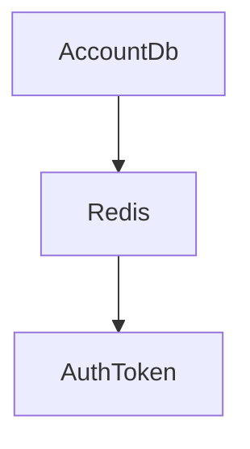

##   

### ASP.NET Core 7버전으로 작성한 Web API 입니다.

개발 시작일 23.07.10(월)
## 7월 11일(화) 개발일지
### 개발 사항 : 
1. ASP.NET Core Web API 구글 로그인 연동
   
### 오늘 개발 이슈 : 
1. API 호출 후 리디렉션 팝업 생성 안됨 (해결 방법 : AddAuthentication() 설정 함)
2. 리디렉션 설정이 다름으로 인한 액세스 허용 문제 (해결 방법 : googleOptions.CallbackPath 리디렉션 URI 코드로 설정 )

### 받은 피드백 : 

### 7월 12일(화) (예정)
1. 페이스북 로그인 연동(시간 있으면^^)
2. 오늘 구글 로그인 연동 다시 공부 하면서 블로그 작성

